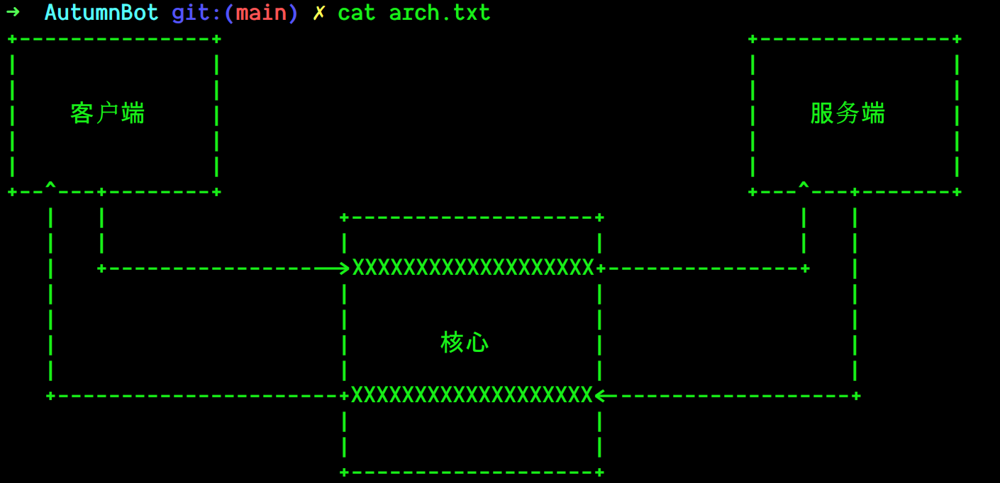

<div align="center">


# 暮秋
> 一个俯瞰世界的机器人

__当前暮秋正在开发中，API可能发生剧烈变化__

</div>

## 简介
暮秋是一个多功能的机器人，二零二一年九月二十五日出生在X档案研究所，暮秋的目的是帮助人们完成任何事情。

## 架构



暮秋总体上由三个组件构成：核心（Core），服务端（Service），客户端（Client）。暮秋对外界做出响应的一套标准流程是：
```
外界通过客户端向暮秋发送信息
-> 客户端如果可以自行处理信息，则将处理结果反馈给外界
-> 客户端如果不能自行处理信息，需要请求其他的服务，就像核心请求相关服务
-> 核心收到客户端的服务请求后，会命令对应服务端处理相关数据
-> 服务端收到核心的命令后，将相关数据处理完毕并交付给核心
-> 核心将服务端处理完成的数据交付给客户端
```
整个过程的数据通信都在Websocket的基础下进行，对于服务端与客户端来说，核心就是一个Websocket服务器，对于核心来说，客户端和服务端就是一个Websocket客户端。

__需要注意的是： 客户端应该是暮秋与外界交互的唯一途径__

## 通信规范
暮秋的客户端和服务端需要有统一的通信数据规范才能被核心识别并进行数据交流，由于进行通信的数据结构非常简单，所以暮秋选用了JSON进行数据通信：
- 客户端通信规范
    ```JSON
    {
        "header": "标识自身",
        "service": "需要请求哪个服务端",
        "body": "辅助服务端处理的数据"
    }
    ```
- 服务端通信规范
    ```JSON
    {
        "header": "标识自身",
        "client": "将处理好的数据交付给哪个客户端",
        "body": "处理结果"
    }
    ```

所以任何一个客户端或是服务端，只需要在实现Websocket通信的基础上遵守这一套简单的JSON就能通过Core交互了。

### 挂载
对于内核来说，当得到一个客户端的请求时需要查找对应的服务端发送命令，当得到一个服务端的结果时需要查找对应的客户端交付结果，所以任何一个服务端或是客户端，在连接上内核之后的第一件事就是发送一条挂载请求，挂载请求遵循统一的通信规范：
- 客户端挂载请求
    ```JSON
    {
        "header": "标识自身",
        "service": "mount",
        "body": ""
    }
    ```
- 服务端挂载请求
    ```JSON
    {
        "header": "标识自身",
        "client": "mount",
        "body": ""
    }
    ```
如果核心收到的客户端或服务端的消息中，`client`或`service`一项的值为`"mount"`，则将消息识别为挂载请求，核心并不会处理挂载请求中的`body`字段，`body`的内容无关紧要，建议为空。

### 卸载
当一个客户端或服务端 __主动__ 关闭连接时，需要发送一条卸载请求给核心，卸载请求与挂载请求类似：
- 客户端卸载请求
    ```JSON
    {
        "header": "标识自身",
        "service": "umount",
        "body": ""
    }
    ```
- 服务端卸载请求
    ```JSON
    {
        "header": "标识自身",
        "client": "umount",
        "body": ""
    }
    ```

## 开发规范
### 示例
> 使用JavaScript编写的 `SayHello` 的客户端与服务端示例

对于客户端: [./AutumnBot.Client/AutumnBot.Client.SayHello](./AutumnBot.Client/AutumnBot.Client.SayHello)
```JavaScript
import WebSocket from "ws";

const ws = new WebSocket("ws://127.0.0.1:3000");

ws.on("error", console.error);

ws.on("open", function open() {
  console.log("Successfully connected to AutumnBot.Core");


  // Mount message
  ws.send(JSON.stringify({
    header: "AutumnBot.Client.SayHello",
    service: "mount",
    body: ""
  }));

  // Request service
  ws.send(JSON.stringify({
    header: "AutumnBot.Client.SayHello",
    service: "AutumnBot.Service.SayHello",
    body: "Hi",
  }));
});

ws.on("close", function close(code, reason) {
  ws.send(JSON.stringify({
    header: "AutumnBot.Client.SayHello",
    service: "umount",
    body: ""
  }));
});

ws.on("message", function message(data) {
  console.log(JSON.parse(data)["body"]);
});
```

对于服务端：[./AutumnBot.Service/AutumnBot.Service.SayHello/](./AutumnBot.Service/AutumnBot.Service.SayHello/)
```JavaScript
import WebSocket from "ws";

const ws = new WebSocket("ws://127.0.0.1:3000");

ws.on("error", console.error);

ws.on("open", function open() {
  console.log("Successfully connected to AutumnBot.Core");


  // Mount message
  ws.send(JSON.stringify({
    header: "AutumnBot.Service.SayHello",
    client: "",
    body: "",
  }));
});

ws.on("message", function message(data) {
  let header = JSON.parse(data)["header"];

  console.log("Received message from " + header + " : " + JSON.parse(data)["body"]);

  if(JSON.parse(data)["body"] == "Hi") {
    ws.send(JSON.stringify({
      header: "AutumnBot.Service.SayHello",
      client: header,
      body: "Hello!",
    }));
  } else {
    ws.send(JSON.stringify({
      header: "AutumnBot.Service.SayHello",
      client: header,
      body: "ERROR",
    }));
  }
});
```

### 统一配置
每一个暮秋的服务端或客户端根目录下都必须有一个`config.sh`文件，这个文件是为了统一启动或构建自身，`config.sh`的模板如下：
```bash
cd $(dirname $0)

function build() {
    # 构建自身
}

function start() {
    # 启动自身
}

if [ $1 = "build" ]
then
    build
elif [ $1 = "start" ]
then
    build
    start
fi
```
每一个`config.sh`都必须严格按照此模板实现自身的启动与构建，例如`AutumnBot.Client.SayHello`模块：
```bash
cd $(dirname $0)

function build() {
    npm install
}

function start() {
    npm run start
}

if [ $1 = "build" ]
then
    build
elif [ $1 = "start" ]
then
    build
    start
fi
```

- `config.sh`并不是客户端或服务端项目自身的构建文件，项目使用什么构建工具并不重要，只需要在`config.sh`中调用对应的工具就行

暮秋并不规定需要用什么语言编写服务端或客户端，只要能解析JSON，建立Websocket通信即可，上述示例并不是一个概念上完整的粒子。

例如： 暮秋拥有一个QQ客户端(AutumnBot.Client.QQ)，用于和QQ交互消息，这个QQ客户端具有很多服务，当QQ客户端收到外界的相关消息后，可以向`SayHello`的服务端(AutumnBot.Service.SayHello)请求相关数据用于回复外界。

### Commit Message规范
对于每一个Commit，说明是来自哪个模块的更改，例如来自内核：
```
AutumnBot.Core: Separate message and message_pool
```

### .gitignore
加入新的客户端或服务端，需要在暮秋根目录下的`.gitignore`文件中（即[./.gitignore](./.gitignore))统一添加

## 命名
- 新的客户端必须以`AutumnBot.Client.`起始后跟客户端名
- 新的服务端必须以`AutumnBot.Service.`起始后跟服务名

## License
The MIT License (MIT)

Copyright (c) 2022 Muqiu Han

Permission is hereby granted, free of charge, to any person obtaining a copy
of this software and associated documentation files (the "Software"), to deal
in the Software without restriction, including without limitation the rights
to use, copy, modify, merge, publish, distribute, sublicense, and/or sell
copies of the Software, and to permit persons to whom the Software is
furnished to do so, subject to the following conditions:

The above copyright notice and this permission notice shall be included in all
copies or substantial portions of the Software.

THE SOFTWARE IS PROVIDED "AS IS", WITHOUT WARRANTY OF ANY KIND, EXPRESS OR
IMPLIED, INCLUDING BUT NOT LIMITED TO THE WARRANTIES OF MERCHANTABILITY,
FITNESS FOR A PARTICULAR PURPOSE AND NONINFRINGEMENT. IN NO EVENT SHALL THE
AUTHORS OR COPYRIGHT HOLDERS BE LIABLE FOR ANY CLAIM, DAMAGES OR OTHER
LIABILITY, WHETHER IN AN ACTION OF CONTRACT, TORT OR OTHERWISE, ARISING FROM,
OUT OF OR IN CONNECTION WITH THE SOFTWARE OR THE USE OR OTHER DEALINGS IN THE
SOFTWARE.